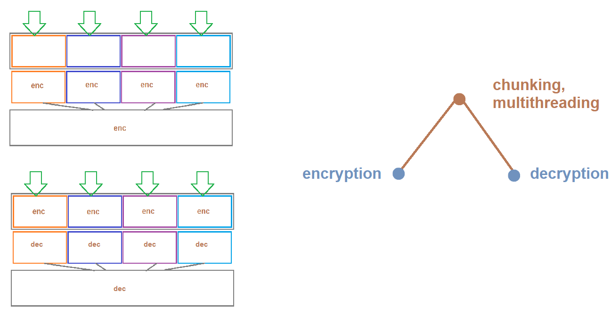

# Security-using-Armstrong-number
This project is based on creating an Encrypting and Decrypting algorithm using Armstrong number and mapping color's RGB into matrix  
Along with this, there is also implementation of
- Multithreading(threads, join, daemon)
- File handling(open, seek file pointer, chunking)
- Abstract base class 

## Implementation
For faster Encryption and Decryption file chunking and threading are done on the target file.  
 
###  Encryption process :
1. Take the file(_any_) which needs to be Encrypted
2. File is divided into 4 chunks, each chunk undergo encryption at the same time using threading
3. Numeric key is created using **Armstrong** number and the **Passphrase** given by the user for encryption.
4. Creating an RGB color with a Numeric key, And mapping(r,g,b) it into _16x16_ matrix.
5. Encryption process is divided into 2 steps:
    * Encrypting every byte of data by taking XOR with the numeric key 
    * Dividing the encrypted byte into nibbles of 4-4 bits(0-15) and formulating them into rows and columns and returning the value placed in the color matrix using these rows and columns.
6. Repeating the above process for every byte and then storing them into an encrypted file. 

###  Decryption process :
1. Take the file(any) which needs to be Decrypted
2. File is divided into 4 chunks, each chunk undergo decryption at the same time using threading
3. Numeric key is created using _Armstrong_ number and the _Passphrase_ given by the user for decryption.
4. Creating an RGB color with a Numeric key, And mapping(r,g,b) it into _16x16_ matrix.
5. Decryption process is divided into 2 steps:
    * Finding the encrypted byte in a color matrix and finding the row and column associated with it, each of them represents nibble of 4-4 bit(0-15) and then combining them to create that encrypted byte.
    * Which then is Decrypted by taking XOR with the numeric key.     
6. Repeating the above process for every byte and then storing them into a file.
7. After the process is completed the original file will be retrieved.

> The Complexity for both the processes is O(n) and with threading, this is a very fast and secure process. 

# Thank you  

